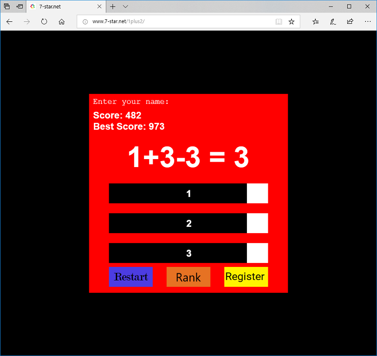

# 1plus2rank
에마뉴엘 페로나토 님이 작성한 포스트 "1+2=3"(https://www.emanueleferonato.com/2018/10/01/123-html5-game-built-with-phaser-update-to-phaser-3-and-commented/) 게임에서 영감을 받아서, "1+2" 게임을 하고 유저명과 점수를 등록해서 순위(rank) 을 확인할 수 있는 기능을 추가했습니다. 키보드 입력이나 canvas 관련 기능은 phaser 3(http://phaser.io) 를 이용했습니다.

* 시작 화면
: 더하기 한 값을 1/2/3 버튼중에서 클릭하면 바로 시작합니다. 시간이 짧기 때문에 빠른 판단(?)이 필요합니다. 1/2/3 중에 답은 하나이지만 레벨이 올라갈수록 암산이 어려워집니다.

* 끝 화면
: 잘못된 선택으로 계산이 틀리면 재시작하던지, 지금 점수를 등록하던지, 현재의 랭킹을 볼 수 있습니다.

* 유저 명/점수 등록
: 시작화면에서 키보드로 입력하면 원하는 문자열을 입력할 수 있습니다. 모바일에서는 가상키보드라도 나와야하는데, 현재는 아무것도 입력이 안됩니다.

* 랭킹 확인
: 20 위까지 유저와 점수, 등록한 시간을 확인할 수 있습니다.

